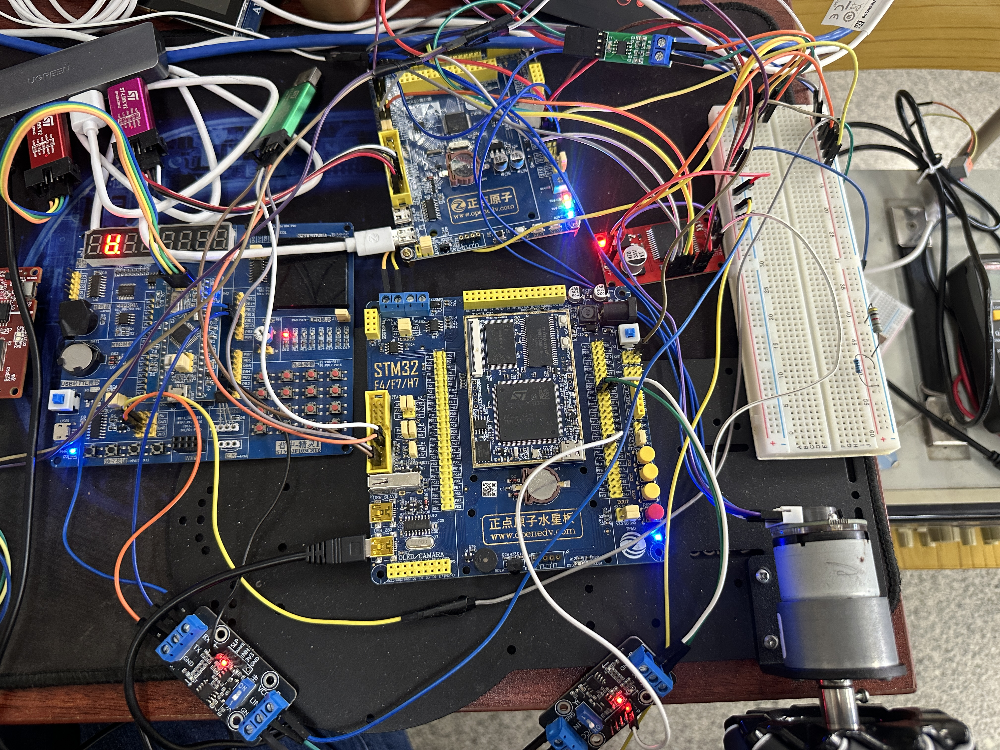
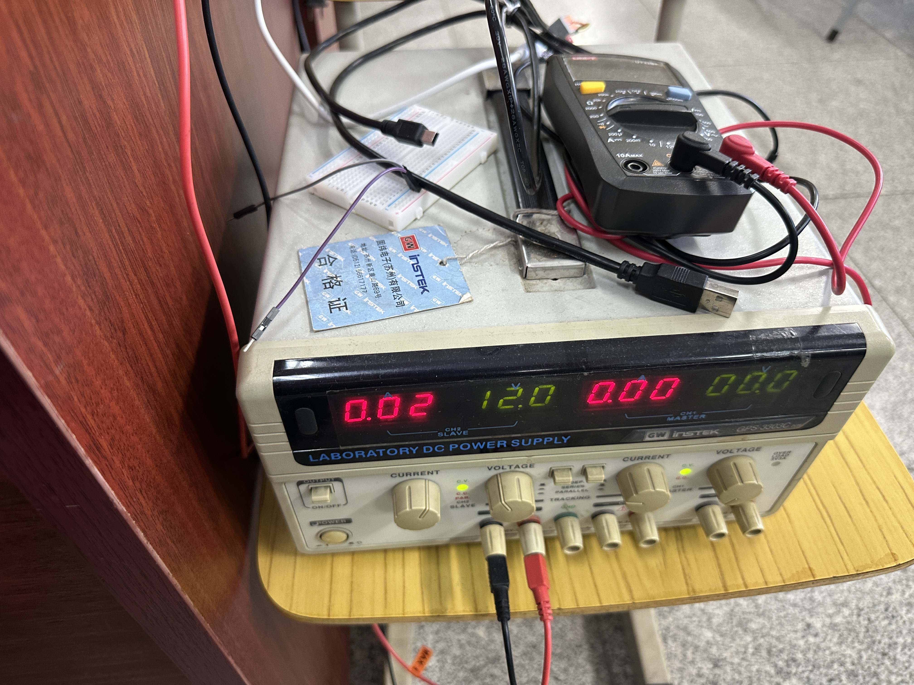
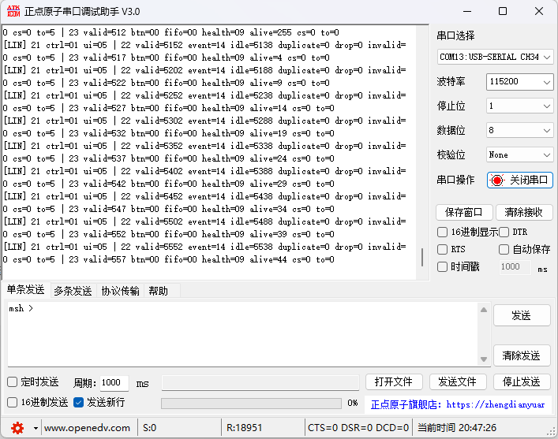
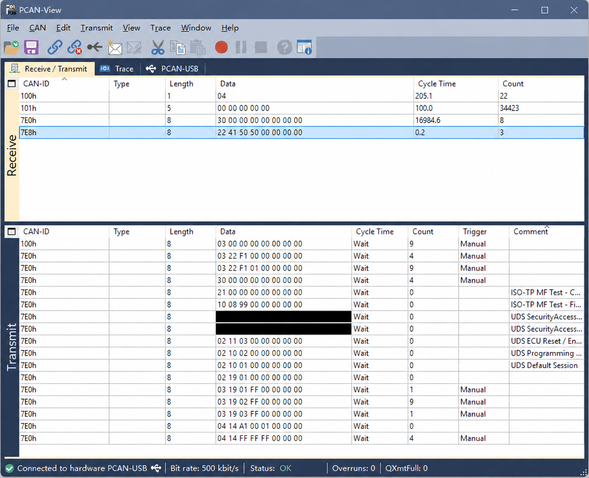
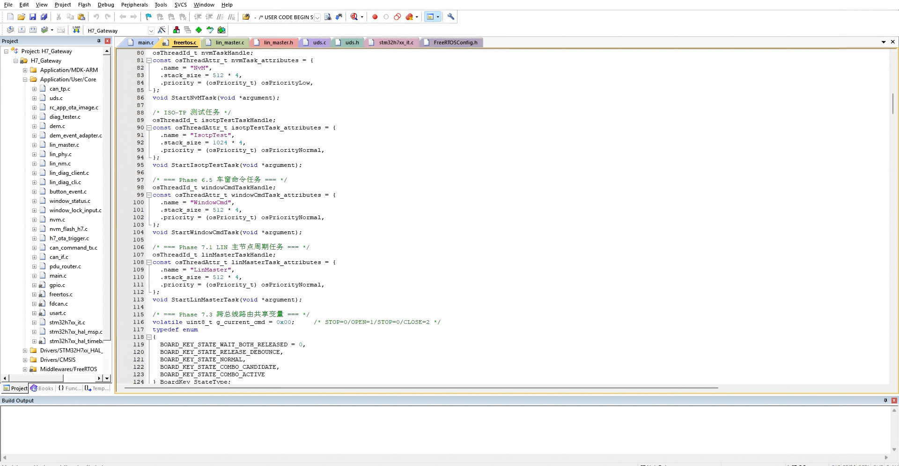
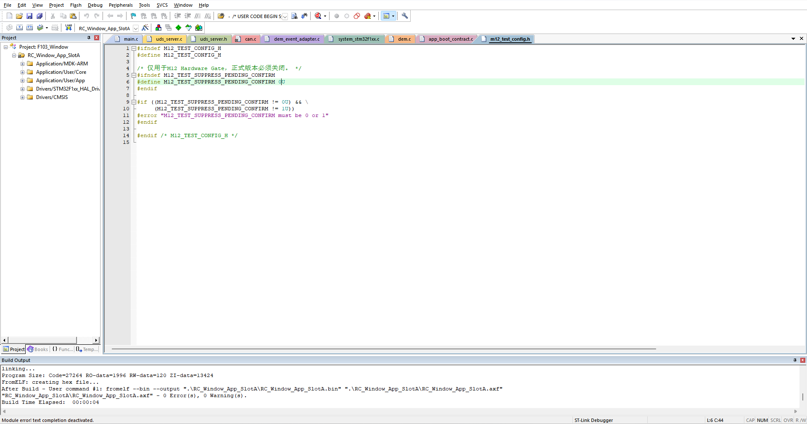
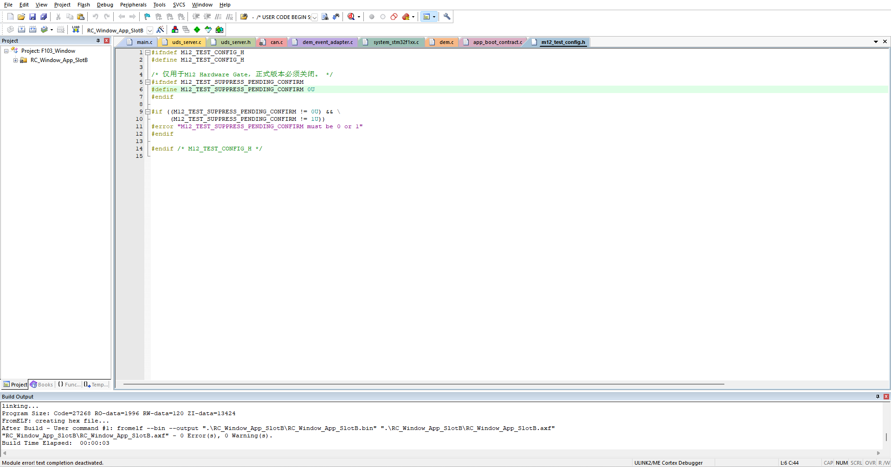

# STM32H7/F1 CAN/LIN 车身网关与车窗 ECU 诊断及 A/B Bootloader 系统

## 项目简介

基于 STM32H743、STM32F103RCT6 和 STM32F103C8T6 构建三节点车身网络，通过 LIN 与 CAN 实现实体按键到车窗电机的控制，并集成 UDS 诊断、A/B OTA 和 Window Lock 配置持久化。



实物图：左侧为 C8，上方为 RC，中下方为 H7，右中部为 VNH2SP30 电机驱动，下方两个为 LIN 模块，右下侧为电机。

## 系统拓扑

```text
C8 实体按键 / LIN Slave
          │ LIN 19.2 kbps，USART3 + TJA1021
          ▼
H7 LIN Master / CAN 网关 / UDS与OTA主机 / NvM
          │ CAN 500 kbps
          ▼
RC 车窗控制 / 编码器防夹与堵转 / UDS / A/B Bootloader
          │
          ▼
         电机
```

## 通信与命令

| CAN ID | 方向 | 用途 |
| --- | --- | --- |
| `0x100` | H7 → RC | 车窗控制命令 |
| `0x101` | RC → H7 | 车窗状态反馈 |
| `0x7E0` | Tester → RC | UDS 请求 |
| `0x7E8` | RC → Tester | UDS 响应 |

`0x100` 命令：`00` STOP、`01` AUTO OPEN、`02` AUTO CLOSE、`03` RESET、`04` JOG OPEN、`05` JOG CLOSE。

LIN `0x21` 由 H7 发布控制与 ACK；`0x22` 由 H7 发 Header、C8 回传按键事件与 Sequence；`0x23` 由 H7 发 Header、C8 回传状态。H7 每 20 ms 轮询 `0x22`，C8 在收到 ACK 前保留并重传事件，H7 根据 Sequence 去重。

## 诊断与 OTA

RC App 支持 UDS 服务 `0x10/0x11/0x14/0x19/0x22/0x27/0x31/0x34/0x36/0x37`；RC Boot 支持 `0x10/0x11/0x22/0x27/0x31/0x34/0x36/0x37`。App DID 为 `F100/F101/F102/F103`，Boot DID `F1A0` 用于查询下载目标。

OTA 通过 ISO-TP 传输。镜像 CRC 校验使用 RID `F001`，请求格式为 `31 01 F0 01 CRC32[4 bytes]`；成功响应为 `71 01 F0 01 00`，校验失败响应为 `71 01 F0 01 01`。

| RC Flash 区域 | 地址 |
| --- | --- |
| Boot | `0x08000000–0x08007FFF` |
| Slot A | `0x08008000–0x080237FF` |
| Slot B | `0x08023800–0x0803EFFF` |
| Metadata A | `0x0803F000–0x0803F7FF` |
| Metadata B | `0x0803F800–0x0803FFFF` |

新镜像先进入 Pending，Boot 校验 CRC32、Vector 和 Descriptor，并记录启动 Attempt。App Confirm 后成为 confirmed 槽；连续未 Confirm 达到三次尝试上限时，Rollback 到已有 confirmed 槽。

SecurityAccess 使用固定 Seed/Key 演示机制，公开仓库已移除具体常量。

## 车窗控制与可靠性

车窗堵转与防夹保护采用编码器判据。

- OPEN 堵转：启动宽限 500 ms；每 50 ms 采样，编码器增量小于 50 连续 20 次则停止，不锁存，可再次操作。
- CLOSE 防夹：启动宽限 500 ms；编码器增量小于 80 连续 3 次则反转 500 ms、停止并锁存，需 RESET 解除。

系统包含 CAN Bus-Off 检测与恢复、RC IWDG、Window Lock、LIN Sleep / Remote Wake。H7 NvM 使用双 Sector、CRC 和最后写入的 Commit 持久化 Window Lock 配置。

软件结构参考 AUTOSAR Classic 的分层与模块职责设计，对通信、诊断、故障管理和非易失数据管理进行模块化拆分。

## 实验照片与通信记录

### 实验供电



实验使用直流稳压电源供电，配合万用表检查连接与电压。照片记录的是拍摄时的设备状态，不作为接线或供电参数说明。

### LIN 通信



截图中，LIN 0x22、0x23 的有效响应计数持续增长；所示时段 duplicate、drop、invalid 和 checksum error 均为 0。

### CAN 与 UDS 调试



PCAN-View 中的车窗命令、状态反馈及 UDS 调试记录，SecurityAccess 数据已遮挡。

### H7 工程



H7 工程模块与 FreeRTOS 任务配置。

### RC App A/B 构建





Slot A 和 Slot B 均编译通过，结果为 0 Error、0 Warning，并通过构建后命令导出各自的 BIN。

## 代码目录

- `gateway_h7/`：LIN Master、CAN 网关、UDS/OTA、NvM。
- `window_ecu_rc/`：车窗控制、防夹、堵转、ISO-TP、UDS。
- `bootloader/`：A/B Bootloader、镜像校验、Metadata、Flash 下载。
- `button_node_c8/`：按键采集、LIN Slave、Sleep/Wakeup。

仓库主要保留项目核心业务源码，STM32 HAL、CMSIS、FreeRTOS 等通用依赖未纳入。
